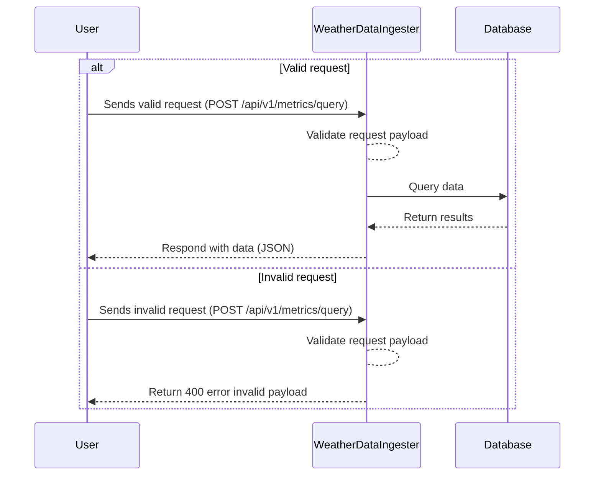
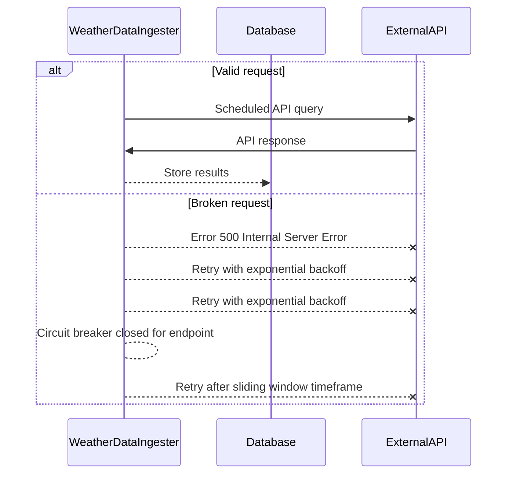

# WeatherDataIngester

This project is to build a service that receives weather data from multiple weather sensors via different APIs. Each
sensor reports metrics such as temperature, humidity, wind speed, etc. The service allows for efficient querying of
aggregated
sensor data through a REST API the `weather-data-ingester` service exposes.

Weather sensors are represented by three modules in this project `mace-head`, `malin-head` and `sherkin-island`, all 3
are
weather
stations in Ireland. These provide basic REST API endpoints with random weather data. These services can be started to
provide data to the central `weather-data-ingester` service.

## Running locally

Prerequisites

- Java 21+
- Maven 3.9+
- Docker (for Postgres via Docker Compose)

Please first ensure the Docker daemon is running.

From the root directory please install all modules (Docker is required for tests)

```
mvn clean install
```

Start the Postgres docker container

```
docker compose up -d
```

Start weather station sensors in separate terminals (Will allow us to test fault tolerance later)

```
mvn -pl mace-head spring-boot:run
```

```
mvn -pl malin-head spring-boot:run
```

```
mvn -pl sherkin-island spring-boot:run
```

In a new terminal start main weather-data-ingester service (main service)

```
mvn -pl weather-data-ingester spring-boot:run
```

## Features of Service

### Documentation

The API endpoints provided by the service are documented using OpenAPI docs via the following endpoint:

[API Documentation](http://localhost:8080/swagger-ui/index.html)

Please run the `weather-data-ingester` service before attempting to reach the documentation. A sample request is
provided in the OpenAPI spec.

### Scheduling

External weather sensors are queried on a scheduled cron, ingesting data into the database at a regular interval using
Spring Scheduling.

### Resilience & Fault Tolerance

The service uses [Resilience4j](https://resilience4j.readme.io/docs/getting-started) a lightweight fault tolerance
library designed for custom circuit breaking, rate limiting and retrying. This service makes use of exponential backoff
provided by Resilience4j and also circuit breaking when a service is unresponsive, ensuring that downstream endpoints
are not overwhelmed and preventing cascading failures.

## Service Flow Diagrams

### User Request



### External API Ingestion



## Testing

Unit and integration testing has been provided for the main `weather-data-ingester` module and can be run using the
following commands.

Unit tests

```
mvn clean test
```

Integration tests

```
mvn clean verify
```

## Potential improvements

Some improvements that this service could benefit from would be.

- Support for ingestion of other types of API, for example SOAP, Web Socket, gRPC etc.
- More flexible parsing of external API endpoint data, current approach assumes all services will return data in the
  same format
- Threading of external API requests. All requests are done by a single scheduler one after the other. For this simple
  example this is fine but for a production service ensuring that all requests are carried out when they are scheduled
  using threading/ worker architecture would be much more reliant.
- More REST API endpoints in main service. Endpoints to allow fetching of all sensors currently registered, registering
  new sensors etc.
- Improved Database schema, currently only two tables are used, partitioning and refinement of schema would allow for
  increased amounts of data to be processed.